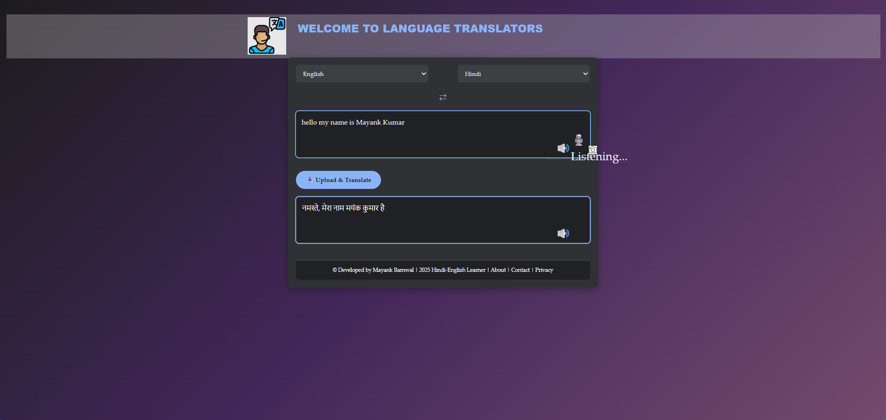
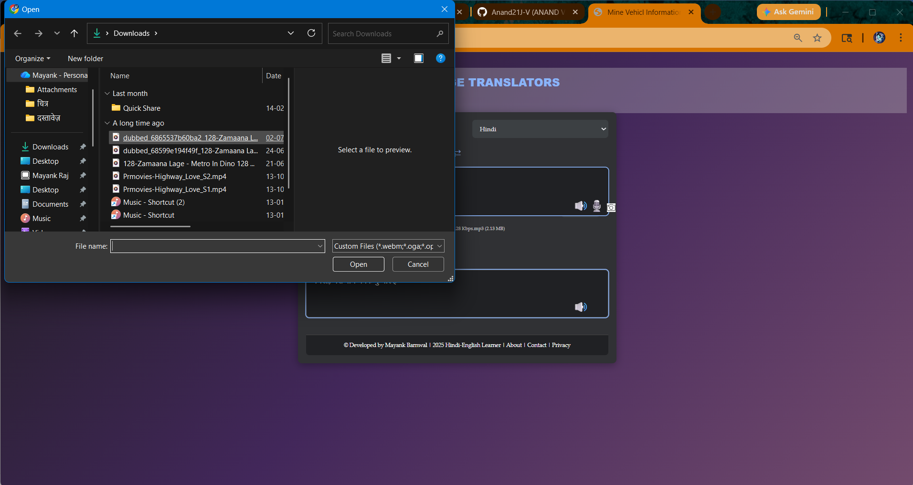

# 🎙️ Voice to Text & Live Translation

An intelligent speech processing web application that converts spoken language into text and performs real-time translation. This system enhances multilingual communication and accessibility by enabling users to interact using voice and instantly translate it into another language.

---

## 🚀 Features

- 🎤 Voice to Text (Speech Recognition)
- 🌐 Real-Time Language Translation (English ↔ Hindi)
- 🔊 Text-to-Speech Output
- 📂 Upload & Translate Audio Files
- 🎬 Audio Processing for Media (Movie Dialogue Translation / Dubbing Concept)
- ⚡ Fast and User-Friendly Interface
- 📱 Responsive Design

---

## 🛠 Tech Stack

- **Frontend:** HTML, CSS, JavaScript  
- **Backend:** Python / PHP (based on your implementation)  
- **Libraries/Tools:** Speech Recognition, Translation APIs, Text-to-Speech  
- **Server:** Localhost (XAMPP / Flask)

---

## 📸 Screenshots

  
  

---

## ⚙️ How to Run

1. Clone the repository
2. Open the project folder  
3. Run the server (XAMPP / Python server)  
4. Open browser and go to:

---

## 💡 Future Improvements

- 🎥 Full Video Dubbing with Lip Sync  
- 🌍 Support for Multiple Languages  
- ☁️ Cloud Deployment  
- 📱 Mobile App Version  

---

## 👨‍💻 Author

**Mayank Kumar**  
📧 mayankbarnwal72@gmail.com  
🔗 LinkedIn: https://www.linkedin.com/in/mayank-kumar-5b3171290/  
💻 GitHub: https://github.com/Mayank934j  

---

## ⭐ Support

If you like this project, give it a ⭐ on GitHub!   
